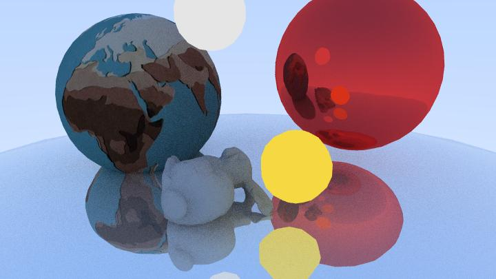
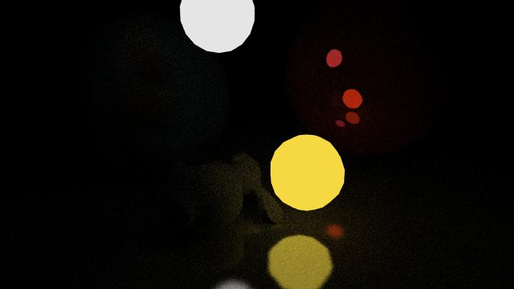

# 《真实感渲染》大作业

## 渲染结果展示

“晴天”渲染结果：

“夜晚”渲染结果：

- 夜晚场景中，没有开启环境光，场景整体非常昏暗。
- 场景中只有两个光源，白色球体和黄色球体。兔子模型靠近黄色球体，被正确渲染为淡黄色。

## 作业完成情况

| 作业要求              | 完成情况 | 备注                                                         |
| --------------------- | -------- | ------------------------------------------------------------ |
| 三角网格模型加载      | 🟡        | 使用第三方库 `pyvista` 解析 `.obj` 文件。这是一个 Python 3D 渲染库，但作业仅仅使用其中的 `.obj` 文件解析功能。 |
| 透视投影              | ✅        |                                                              |
| 场景漫游              | ❌        | 渲染性能非常糟糕，优化后还至少需要 10 s，无法支持实时渲染，没有场景漫游的意义。主要有 2 个原因导致渲染效率不足：(1) 使用光线追踪技术实现渲染你；(2) 使用 Python + JAX 进行实现，收到 Python 运行性能限制。 |
| 至少包括 3 个三角模型 | ✅        | 5 个 mesh 球体（红色、黄色、白色球 + 做地面的球“地面球” + 贴上地图的“地球”）+ 兔子 |
| 实现 Phong 光照       | ✅        | 环境光（天空）+ 漫反射（夜晚场景中的兔子被渲染为黄色）+ 高光（红色球） Phong shading 特点：地面球的三角网格粒度非常粗，但对天空的反射仍然很均匀，说明使用的是 Phong 渲染技术。 |
| 实现光线追踪算法      | ✅        | 并且使用 JAX 矢量化求交运算。                                |
| 实现纹理贴图          | ✅        | 见渲染图中的”地球“，球体上的地图使用贴图功能渲染。           |
| (附加项) 实现全局光照 | ✅        | 由特殊的对象”天空“实现，效果见”晴天“场景渲染图。             |

渲染性能：

- 场景：晴天场景
- 图片尺寸：720 x 405
- 每像素光线数：30
- 最大反射次数：6
- CPU：9950x，单 Python 进程、线程渲染
- 渲染用时：48 min

## 渲染管线设计

注：

- 蓝色虚线框部分使用 `jax + jit` 实现矢量化求交。矢量化后，100 k 条光线与 1 k 个三角面片的求交大约需要 1 s。
- 为了避免 `jax.jit` 重复编译 `hit()` 函数，需要统一输入矩阵的大小，所以 `Ray batch` 后还添加了一个 `batch collector` 流程将多个小 batch 拼接为一个固定长度（100 k 条光线）的大 batch。
- 虚线框部分可高度并行化，但没有在本作业中实现。
- 现在的实现中，各个 mesh 串行地与 ray batch 求交，这个过程其实也能并行化。

## 改进方向

**漫反射的亮度贡献过小**

表现：展示的两个场景中，兔子距离黄色光源（黄色球）非常近，但兔子几乎没有被渲染成黄色。“夜晚”场景相比“晴天”场景去除了环境光，整个场景几乎变成黑色，漫反射基本没有贡献。

原因：现在的代码实现中，一条光线仅当到达某个光源时，其贡献才被累加回渲染图片中。但一条光线到达某面片被漫反射时，仅从出射方向半球中采样 1 个新方向继续传播。如果一个物体距离光源较远，那采样出的这条新光线几乎不可能与光源相交，直接被忽略。所以只有距离光源非常近的兔子能被漫反射照亮。

解决方法：多重重要性采样。

**颜色混合、光照强度等不符合直观**

表现：黄色光源经过红色球反射后，被渲染为红色，但实则应该被渲染成近似褐色的红色。

原因：光线反射、颜色混合时，直接在 RGB 通道上做乘法、加法，可能不符合实际。

解决：Gamma 矫正、更加精细地建模反射时的颜色变化。

**CPU 利用率低**

表现：虽然使用了 JAX 进行矢量化计算，但仍然不能达成 100% CPU 占用率。

原因：待查证。

解决：

- 使用多进程渲染

如果使用硬件加速（显卡提供的 API），有望大幅提升效率，但超出本次作业的要求范围，不多考虑。

**拧巴的反射特性模拟**

漫反射、高光被独立模拟，编写了两套代码。但这两个反射现象应该可以被统一建模，后续可以考虑 BRDF 等反射模型。
